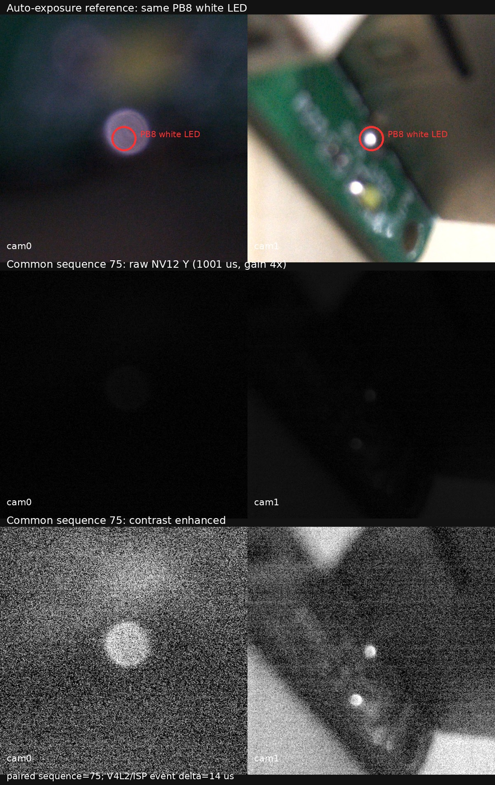

# RK3576 双 IMX586 任务计划 v0.2 阶段 1-7 完整复测报告

## 1. 报告信息

- 复测日期：2026-08-17
- 需求基线：`RK3576 MIPI 相机模组任务计划 v0.2`
- RK3576：双 IMX586，4000x3000 NV12M
- 同步源：外接 STM32 固定 2 Hz XVS
- 光学同步指示：STM32 PB8，约 1 ms 白灯脉冲
- RK3576 调试链路：`/dev/ttyUSB0`，1500000 baud
- 需求 UART 目标：115200、8N1；本轮 MCU UART 未物理连接
- USB Gadget：双 UVC + RNDIS，当前枚举为 USB High-Speed 480 Mbit/s
- 板端 RNDIS 地址：`192.168.55.1`
- 证据根目录：`/home/ywj/rk3576_final_acceptance_led_sync_20260817`

## 2. 总结论

本轮结论为：**阶段 1-7 部分通过，不能判定 v0.2 全部完成。**

已经通过实机复测的主要能力：

1. 两路 IMX586 可同时以 4000x3000 采集。
2. 两路 RKAIQ 上下文、设备节点和 IQ 路径独立，曝光、增益、ISO 控制互不串扰。
3. 外接 STM32 固定 2 Hz XVS 下，两路连续 60 秒各新增 120 帧，均无 sequence drop。
4. 阶段 5 已按 PB8 白灯标准完成光学复测：共同 sequence 65-75 的 11 对原始 NV12 中，两路均检测到同一次白灯脉冲。
5. eMMC 双路短时保存通过；两路各 7 帧、共同 sequence 194-200、无保存失败。
6. 模拟 trigger 到双路 frame_id 的绑定逻辑通过；7 对照片 JPEG/EXIF/CSV 一致。
7. 双 UVC、RNDIS/HTTP 双路图像输出均通过，输出图片均为 4000x3000 且可完整解码。
8. Ubuntu 重新交叉编译的 RK3576 程序与板端运行程序 SHA-256 完全一致。
9. STM32 源码重新编译成功，本地 BIN 哈希保持一致。

尚不能判定完成的核心内容：

1. MCU UART 未接，真实 115200、8N1 控制链路未验收。
2. 当前 MCU 只有固定 2 Hz，真实 4 Hz 和 2/4 Hz 切换未验收。
3. 真实 PPS、GPRMC/NMEA、UTC_LOCKED 未接入。
4. 本轮 trigger_id 到双路 frame_id 使用软件模拟 trigger，不是真实 MCU 报文闭环。
5. 没有示波器测量 XVS、两颗 IMX586 曝光起点及其误差。
6. cam0/cam1 IQ 文件路径独立，但 JSON 内容相同，尚未完成广角/鱼眼独立标定。
7. 未完成整机功耗、USB3 SuperSpeed、数小时及 1000/10000 次触发长稳验收。
8. 本轮 ST-Link 在复测过程中掉线，无法重新读取 MCU 板内 Flash，所以不能用哈希证明板内固件等于本地 BIN。

## 3. 阶段结论矩阵

| 阶段 | 需求摘要 | 本轮状态 | 结论边界 |
|---|---|---|---|
| 1 | 双 IMX586 同时出图 | 通过 | 4000x3000 双路同时采集、60 秒 2 Hz、双 UVC 图像均通过 |
| 2 | 独立 ISP Pipeline / IQ | 部分通过 | 独立上下文、独立 IQ 路径和参数隔离通过；两个 IQ JSON 内容相同，镜头专项 IQ 未完成 |
| 3 | 2-4 Hz、性能与首轮功耗 | 部分通过 | 双路固定 2 Hz、丢帧、CPU、内存、温度已测；4 Hz、单路基线、DDR/ISP 占用和整机功耗未测 |
| 4 | 完整驱动与 UART 控制 | 部分通过 | 统一程序及 UART 协议软件自测通过；MCU UART 物理链路未接，真实串口控制未验收 |
| 5 | PPS/NMEA/Trigger 硬件同步 | 部分通过 | 真实 2 Hz XVS 和 PB8 光学同步通过；PPS/NMEA/UTC、真实 trigger_id 绑定和示波器精度未完成 |
| 6 | 曝光时间估算与 EXIF | 部分通过 | JPEG、ExposureTime、ISO、frame_id、camera_id、模拟 trigger metadata 通过；真实 UTC 和响应延迟标定未完成 |
| 7 | UVC、网口、eMMC | 通过，附限制 | 三个后端均实测可用；UVC 当前为 USB2 High-Speed，UART 物理控制依赖阶段 4 未验收 |

## 4. 版本与可重复构建

### 4.1 RK3576 程序

本轮执行了完整清理和 AArch64 交叉编译：

```bash
cd /home/ywj/rk3576_sdk/TaishanPi-3-Linux/app/camera_uart
make -f Makefile.camera_aiq aarch64
```

构建成功。上游 UVC 源码存在 signedness、unused variable 等编译警告，但没有编译或链接错误。

| 对象 | SHA-256 |
|---|---|
| Ubuntu 新编译 `camera_aiq_test` | `c514571b29cb68b31486ee85eb0732067793c6360a9755276e869d7bd0c1a7a3` |
| 板端 `/root/camera_uart/camera_aiq_test` | `c514571b29cb68b31486ee85eb0732067793c6360a9755276e869d7bd0c1a7a3` |
| 板端 `/usr/lib/librkaiq.so` | `c648906539e7395705cfddc11cbeab36f2f3e7643d7b2a0bce4d87ed5d9892bd` |
| 板端 `/usr/bin/rkaiq_3A_server` | `db0490f13e77039cc9954840901dd9e5b1e62f961b4fd8e0daa4314dbcacd2c7` |

结论：**Ubuntu SDK 当前源码重新编出的最终程序与板端运行程序逐字节一致。**

### 4.2 IQ 文件

| 对象 | SHA-256 |
|---|---|
| `/etc/iqfiles/cam0/imx586_default_default.json` | `d0f4a039190140e17995441f72dd162c0157e85ddea808281d3010cb508bb027` |
| `/etc/iqfiles/cam1/imx586_default_default.json` | `d0f4a039190140e17995441f72dd162c0157e85ddea808281d3010cb508bb027` |

两个目录和两套 RKAIQ 上下文已经分开，但两个 JSON 内容完全相同。因此可证明“独立加载和独立控制”，不能证明“广角/鱼眼已经分别调好 IQ”。

### 4.3 STM32 固件

本轮重新执行：

```bash
cd /home/ywj/stm32_gcc_build
./build.sh
```

结果：

- ELF text/data/bss：36536 / 1728 / 928 bytes
- BIN 大小：38268 bytes
- BIN SHA-256：`0891211c4916ca0bb72e9229e3cf6c9b45b770b86b4c338b8ce3091f6ffe7ffe`
- 本轮哈希与复测开始前的本地 BIN 哈希一致

编译器报告 `_close`、`_fstat`、`_read` 等裸机 libc syscall 未实现警告，不影响当前定时器、GPIO 和 XVS 固件生成。

本轮尝试用 ST-Link 回读 MCU Flash 时先出现 `reset device failed`，再次尝试出现 `open failed`，之后 `0483:3748 ST-LINK/V2` 从 USB 列表消失。因此：

- 本地 STM32 源码可重复构建：通过。
- 本地 BIN 内容稳定：通过。
- 本轮 MCU 板内 Flash 与本地 BIN 的哈希一致性：**未测试**。
- MCU 实际 2 Hz XVS/PB8 行为与预期一致，但行为一致不能替代 Flash 哈希一致。

## 5. 阶段 1：双路同时出图

### 5.1 测试流程

为避免后台 UVC 服务占用相机，直接测试期间停止服务并使用统一程序独占两路：

```text
stream-start all
wait 5000
status all
capture-status all
```

两路映射：

- cam0：采集 `/dev/video22`，AIQ params `/dev/video29`，sensor `m00_b_imx586 4-001a`
- cam1：采集 `/dev/video31`，AIQ params `/dev/video38`，sensor `m01_b_imx586 5-001a`

### 5.2 结果

- 两路均成功进入 STARTED。
- 两路均输出 4000x3000 NV12M。
- 60 秒固定 2 Hz 段，两路各新增 120 帧。
- 两路最终 `fps_x1000=2000`。
- 两路 `sequence_drops=0`、`last_errno=0`。
- 双 UVC 拉出的两张图也均为 4000x3000 且可解码。

结论：阶段 1 通过。

## 6. 阶段 2：独立 ISP / IQ 与参数隔离

### 6.1 独立性测试

先给两路设置不同目标：

- cam0：5000 us、2x、ISO 100
- cam1：20000 us、8x、ISO 400

实际回读：

- cam0：5004 us、2x、ISO 100
- cam1：19996 us、8x、ISO 400

随后只修改 cam0 曝光：

- cam0 变为 9998 us、2x
- cam1 保持 19996 us、8x

随后只修改 cam1 增益：

- cam0 保持 9998 us、2x
- cam1 变为 19996 us、4x、ISO 200

最后分别设置 ISO：

- cam0：9998 us、3x、ISO 150
- cam1：19996 us、10x、ISO 500

所有最终状态均满足：

- `manual_settings_verified=1`
- `manual_settings_pending=0`
- `last_aiq_error=0`

### 6.2 结论

独立 sensor、独立 RKAIQ context、独立 IQ 路径、独立曝光/增益/ISO 控制均通过。由于两个 IQ JSON 哈希相同，AWB、黑电平、LSC、LDC 以及广角/鱼眼差异化调参未完成。阶段 2 判定部分通过。

## 7. 阶段 3：帧率、资源与功耗

### 7.1 固定 2 Hz 稳定性

测试前：cam0/cam1 都为 74 帧。等待 60 秒后：cam0/cam1 都为 194 帧。

| 指标 | cam0 | cam1 |
|---|---:|---:|
| 60 秒新增帧 | 120 | 120 |
| 实测 FPS | 2.000 | 2.000 |
| 最后 sequence | 193 | 193 |
| sequence drop | 0 | 0 |

### 7.2 资源和温度

- 采样数：22
- 初始化瞬时 CPU 峰值：90.9%
- 初始化后 CPU 最小/最大/平均：0.8% / 13.3% / 2.233%
- RSS 峰值：73124 kB
- 最低空闲内存：2615892 kB
- 温度：41.615 C -> 42.538 C

### 7.3 未覆盖项

- 当前 MCU 固定 2 Hz，本轮没有真实 4 Hz。
- 未做单路与双路对照基线。
- 未单独采集 DDR/ISP 占用。
- 没有功率计数据，不能给出待机、单路、双路采集功耗。

阶段 3 判定部分通过。

## 8. 阶段 4：完整驱动与 UART 控制

### 8.1 已实现的软件结构

统一程序 `camera_aiq_test` 提供以下控制族：

- 流：`stream-start`、`stream-stop`、`capture-status`
- 图像参数：`auto`、`exposure`、`gain`、`iso`、`fps`、`status`
- eMMC：`save-start`、`save-stop`
- 照片/EXIF：`photo-start`、`photo-stop`、`photo-status`
- UVC：`uvc-start`、`uvc-stop`、`uvc-status`
- 网口：`net-start`、`net-stop`、`net-status`
- 同步与绑定：`sync-status`、`sync-bind-*`、`sync-sim-*`
- MCU/XVS 与时间服务：`xvs-uart-*`、`time-sync-status`
- UART 控制服务与后台模式：`control-uart-*`、`--all-daemon`

控制命令在应用层解析，通过 RKAIQ、V4L2 采集和各输出后端执行，不直接通过 UART 裸写 IMX586 寄存器。这符合需求文档的分层原则。

### 8.2 软件自测

Ubuntu 主机自测：

- `CONTROL_UART_PROTOCOL_SELF_TEST_OK detail="cases=14 pty=115200_8N1_ACK"`
- `XVS_UART_MOCK_TEST_OK`
- `TIME_SYNC_SERVICE_TEST_OK state=HOLDOVER utc_valid=0`
- `STAGE6_HOST_TEST_OK`
- `STAGE7_TIME_PIPELINE_TEST_OK`

板端最终 AArch64 程序内建自测：

- `XVS_PROTOCOL_SELF_TEST_OK`
- `SYNC_BIND_SELF_TEST_OK source=SIM triggers=2 pairs=2 frame_delta_ns=200000`
- `PHOTO_EXIF_SELF_TEST_OK`
- `CONTROL_UART_PROTOCOL_SELF_TEST_OK detail="cases=14"`

### 8.3 结论

UART 协议、命令解析和应用层调用逻辑已经实现并通过伪终端/内建测试。但是 MCU UART 没有物理连接，无法证明真实电平、波特率、收发方向、连续报文和 MCU ACK。因此阶段 4 判定部分通过。

## 9. 阶段 5：硬件触发和光学同步

### 9.1 本轮测试原则

仅比较两路 V4L2 时间戳不能证明两颗 sensor 看到了同一次触发。因此本轮按“rk3576点灯+同步”的标准复测：

1. STM32 固定产生 2 Hz XVS。
2. 与 XVS 同步，让 PB8 白灯点亮约 1 ms。
3. 两路使用相同手动曝光和增益，排除 AE 变化干扰。
4. 同时保存两路原始 NV12。
5. 只按相同 `v4l2_buffer.sequence` 配对。
6. 直接读取原始 NV12 的 Y 平面，在两路各自的 PB8 ROI 中检测白灯。

### 9.2 参数和样本

- cam0/cam1 实际曝光：1001 us
- cam0/cam1 实际增益：4x
- cam0/cam1 ISO：200
- cam0 白灯中心约 `(2155, 1405)`
- cam1 白灯中心约 `(1969, 1315)`
- 正式共同 sequence：65-75
- 配对数：11
- 每个 NV12 文件：18000000 bytes
- 两路 `sequence_drops=0`
- 两路 `save_queue_drops=0`
- 两路 `save_failures=0`

白灯判定使用 25x25 灯芯与 181x181 周围背景，条件为：

```text
core_mean - background_mean >= 3.0
core_mean / background_mean >= 1.5
```

### 9.3 光学结果

- 11/11 个共同 sequence 中，cam0 和 cam1 均检测到 PB8 白灯。
- cam0 灯芯/背景最小比值：1.608。
- cam1 灯芯/背景最小比值：3.115。
- 两路 sequence 集合完全一致。

证据图：



逐对原始 Y 平面统计见：`stage5_evidence/stage5_pair_analysis.csv`。

### 9.4 软件帧事件时间

- 两路 V4L2/ISP 帧事件差：最小 12000 ns，最大 14000 ns，平均 12909.091 ns。
- cam0 平均周期：500024900 ns。
- cam1 平均周期：500025100 ns。

这里的 12-14 us 是 V4L2/ISP 帧事件时间差，不是 IMX586 实际曝光起点差，不能把它写成 sensor 同步精度。

### 9.5 阶段 5 结论

本轮已经证明：固定 2 Hz 外部 XVS 确实驱动两路出帧，并且相同 sequence 的两路图像都拍到了与 XVS 同步的 PB8 白灯。该光学链路通过。

尚未证明：

- XVS 电平、脉宽、边沿抖动和两路 pin26 到达偏差。
- 两颗 IMX586 的实际曝光起点误差。
- 真实 MCU trigger_id 报文与 XVS 边沿一一对应。
- PPS/GPRMC/NMEA 到 UTC 的锁定。
- 4 Hz 和 2/4 Hz 切换。
- 1000/10000 次触发无丢失。

因此阶段 5 判定部分通过，而不是全部完成。

## 10. 阶段 6：曝光时间和照片 EXIF

### 10.1 模拟 trigger 绑定测试

本轮在真实固定 2 Hz 相机出帧条件下，用应用层模拟 trigger 练习数据绑定：

```text
sync-bind-reset 1
sync-bind-log /root/camera_uart/final_retest_led_20260817/photo_sync_bind.csv
photo-start 0 /root/camera_uart/final_retest_led_20260817/photo_cam0
photo-start 1 /root/camera_uart/final_retest_led_20260817/photo_cam1
sync-sim-start 2 8
wait 5000
```

- 模拟 trigger 共 8 个，第 1 个按 sensor 预备规则忽略。
- trigger 2-8 完成 7 对绑定。
- cam0/cam1 各保存 7 张 JPEG。
- 对应 frame_id 203-209。
- 同一个 trigger 下两路 frame_id 完全相同。
- 软件帧事件差：最小 11000 ns，最大 14000 ns，平均 13000 ns。
- `queue_drops=0`、`invalid_metadata=0`。
- `encode_errors=0`、`exif_errors=0`、`write_errors=0`。

### 10.2 EXIF/CSV 结果

全部 14 张 JPEG 均为 4000x3000，可完整解码，EXIF UserComment 与 CSV 逐张一致。最后一张 cam0 照片包含：

```text
camera_id=0
frame_id=209
trigger_id=8
exposure_us=9998
gain_x1000=3000
iso=150
trigger_source=SIM
utc_valid=0
exposure_source=MANUAL_VERIFIED_AT_DQBUF
```

CSV 中还记录 `trigger_monotonic_ns`、`frame_monotonic_ns`、`exposure_start_realtime_ns`、`exposure_center_realtime_ns` 和 `trigger_to_frame_ns`。

### 10.3 结论边界

曝光/增益参数来自出帧时已验证的手动设置，JPEG、EXIF 和绑定数据结构通过。但是：

- `trigger_source=SIM`，不是 MCU。
- `utc_valid=0`。
- `response_offset_ns=0`，尚未用示波器标定 sensor 固定响应延迟。
- 板端系统日期仍约为 2026-06-06，而测试主机日期为 2026-08-17，`DateTimeOriginal` 不能作为真实 UTC 验收结果。

阶段 6 判定部分通过。

## 11. 阶段 7：UVC、网口与 eMMC

### 11.1 eMMC

- cam0/cam1 各保存 7 帧。
- sequence 均为 194-200，集合完全一致。
- 每帧 18000000 bytes。
- 每路保存 126000000 bytes。
- `save_queue_pending=0`。
- `save_queue_drops=0`。
- `save_failures=0`。
- 两路平均周期均为 500025833.333 ns。
- 两路软件帧事件差最小/最大/平均：12000 / 13000 / 12285.714 ns。

原始 NV12 已在完成统计后清理，避免板端 98% 根分区继续增长；CSV 和统计摘要保留。

### 11.2 双 UVC

主机识别到 RK3576 Gadget `2207:0017`：

- `/dev/video0`：MJPEG 4000x3000，声明 4 fps / 2 fps。
- `/dev/video2`：MJPEG 4000x3000，声明 4 fps / 2 fps。

两路同时按 2 fps 打开并抓图成功：

| 文件 | 大小 | 分辨率 | 解码 |
|---|---:|---:|---|
| `uvc_cam0.jpg` | 624434 bytes | 4000x3000 | 完整 |
| `uvc_cam1.jpg` | 974485 bytes | 4000x3000 | 完整 |

当前 USB 拓扑只显示 High-Speed 480 Mbit/s，不是 USB3 SuperSpeed。

### 11.3 RNDIS / HTTP

- `ping 192.168.55.1`：3/3 成功，0% 丢包；最终复核平均 RTT 0.286 ms。
- cam0 连续读取 6 秒：HTTP 200，5425325 bytes。
- cam1 连续读取 6 秒：HTTP 200，8695461 bytes。
- `curl` 的退出码 28 来自人为设置的 6 秒超时，流在超时前持续返回数据，不是 HTTP 服务失败。
- `http_cam0.jpg`：170208 bytes，4000x3000，可完整解码。
- `http_cam1.jpg`：264439 bytes，4000x3000，可完整解码。

客户侧在 RNDIS 直连模式下直接访问：

```text
http://192.168.55.1:8080/
http://192.168.55.1:8080/cam0
http://192.168.55.1:8080/cam1
```

不需要 SSH 端口转发；之前使用 `127.0.0.1:18080` 是 SSH 隧道测试方式，不是最终客户使用方式。

### 11.4 结论

eMMC、双 UVC、双路 HTTP/RNDIS 的数据输出能力通过。阶段 7 通过，限制是 USB 当前只有 480 Mbit/s，且真实 MCU UART 对这些后端的物理控制尚未验收。

## 12. 程序工作原理

### 12.1 控制面

```text
终端命令 / UART 命令
          |
          v
camera_aiq_test 命令解析与状态机
          |
          +--> camera_backend --> RKAIQ --> 曝光 / 增益 / ISO / FPS
          +--> capture_backend --> V4L2 --> 开流 / DQBUF / sequence / 保存
          +--> camera_uvc_backend --> MPP JPEG --> USB UVC
          +--> camera_net_backend --> MPP JPEG --> HTTP MJPEG
          +--> camera_photo_backend --> MPP JPEG + EXIF --> JPEG/eMMC
```

UART 只传递应用层命令。真正的 sensor 配置仍由 RKAIQ/V4L2/driver 完成，UART 不直接写 IMX586 I2C 寄存器。

### 12.2 图像数据面

```text
IMX586 cam0/cam1
        |
        v
MIPI CSI-2 -> rkcif -> rkisp -> /dev/video22,/dev/video31
        |
        v
capture_backend VIDIOC_DQBUF
        |
        +--> 读取 sequence、V4L2 timestamp、实际曝光/增益状态
        +--> 原始 NV12 保存队列
        +--> UVC / HTTP / Photo 帧回调
        +--> trigger_frame_binder
```

`capture_backend` 在每次 `VIDIOC_DQBUF` 后取得 `v4l2_buffer.sequence` 和时间戳，再把帧事件送给绑定器及输出后端。保存和编码使用独立队列，避免慢速存储阻塞采集线程。

### 12.3 同步与绑定

当前真实物理链路：

```text
STM32 2 Hz XVS
      |
      +--> cam0 IMX586 XVS slave --> cam0 frame sequence N
      +--> cam1 IMX586 XVS slave --> cam1 frame sequence N
      +--> PB8 约 1 ms 白灯 --> 被两路图像同时拍到
```

当前应用层绑定测试：

```text
软件模拟 trigger_id
      |
      v
trigger_frame_binder pending queue
      |
      +--> 下一张 cam0 frame
      +--> 下一张 cam1 frame
      |
      v
一条完整 binding：trigger_id + cam0 frame_id + cam1 frame_id + timestamps
```

后续接入 MCU UART 时，不需要重写 V4L2 取帧和绑定算法，只需把 trigger 来源从 `SIM` 换成 MCU UART 解析后的真实 trigger event，并把 PPS/NMEA 解析结果送入 `time_sync_service`。但必须验证 MCU 报文与物理 XVS 是同一次事件，不能仅凭报文到达时间猜测。

## 13. 已知警告和风险

### 13.1 启动/停流日志

开流附近可见：

```text
MIPI_CSI2 ERR2:0xf0000
vblank need >= 1000us if isp work in online, cur 696 us
```

停流附近可见：

```text
CAMHW:E:trigger_isp_readback buf not ready !
XCORE:E:hdlGrp: 7 list items are still in use !
```

本轮 60 秒稳定段和保存段没有持续丢帧，实际停止也成功，但这些日志不能忽略。建议后续核对 IMX586 mode 的 VTS/vblank 和 online ISP 时序，并检查 RKAIQ 退出对象生命周期。

### 13.2 存储空间

板端根分区约 28 GB，目前可用约 638 MB，使用率 98%。正式长稳测试前必须改用独立数据分区或外部存储，并设置轮转/容量上限，否则容易因磁盘满导致保存和系统服务失败。

### 13.3 时间基准

最终板端时间仍为约 `Sat Jun 6 2026`，与测试主机 2026-08-17 不一致。在真实 PPS/NMEA 锁定完成前，不得把板端 realtime 或 EXIF `DateTimeOriginal` 当作有效 UTC。

## 14. 最终板端状态

复测结束后已恢复客户使用形态：

- `camera-uvc.service=active`
- 唯一相机进程：`/root/camera_uart/camera_aiq_test --all-daemon`
- 板端 `usb0=192.168.55.1/24`，状态 UP
- RNDIS 最终 ping：3/3 成功
- 临时原始 NV12 已从 Ubuntu 和板端清理
- 日志、CSV、14 张阶段 6 JPEG、UVC/HTTP 样图、PB8 ROI 和同步证据图均保留

## 15. 下一轮验收顺序

1. 恢复 ST-Link，读取 38268 bytes MCU Flash，与本地 BIN 做 SHA-256 比较。
2. 连接 MCU UART，验证 115200、8N1 双向通信、ACK、异常命令、连续报文和重连。
3. 让同一个 MCU 定时器事件同时产生 XVS 和带 `trigger_id` 的 UART event，验证物理脉冲与报文一一对应。
4. 接入 PPS 和 GPRMC/NMEA，看到 `TIME_SYNC_STATUS state=LOCKED utc_valid=1`。
5. 用真实 MCU trigger 重新跑 1000/10000 次，要求两路 frame 数与 trigger 数一致、无 gap、无 duplicate、无 queue drop。
6. 用示波器同时测 XVS、cam0 pin26、cam1 pin26；若能引出曝光指示，再测两颗 sensor 曝光起点，报告平均、最大和 P99 偏差。
7. 增加真实 4 Hz，并测试 2 Hz/4 Hz 动态切换。
8. 完成广角/鱼眼独立 IQ 标定，确保两个 IQ JSON 内容和标定目标确实不同。
9. 处理 vblank/MIPI 启动警告，完成数小时长稳。
10. 使用功率计完成待机、单路、双路、同步、UVC、HTTP、eMMC 各工况功耗。

## 16. 证据索引

- 总复测日志：`board_retest/full_retest.log`
- 资源采样：`board_retest/resource_top.log`、`board_retest/resource_vmstat.log`
- 内核日志：`board_retest/dmesg_before.txt`、`board_retest/dmesg_after.txt`
- eMMC/照片统计摘要：`retest_summary.txt`
- trigger-frame 绑定：`board_retest/photo_sync_bind.csv`
- 阶段 6 照片和 metadata：`board_retest/photo_cam0/`、`board_retest/photo_cam1/`
- 阶段 5 采集日志：`stage5_board/stage5_capture.log`
- 阶段 5 光学摘要：`stage5_evidence/stage5_summary.txt`
- 阶段 5 逐帧 Y 平面结果：`stage5_evidence/stage5_pair_analysis.csv`
- 阶段 5 证据图：`stage5_evidence/sync_seq75_evidence.jpg`
- UVC 样图：`uvc_cam0.jpg`、`uvc_cam1.jpg`
- HTTP 样图及原始流：`http_cam0.jpg`、`http_cam1.jpg`、`http_cam0.mjpeg`、`http_cam1.mjpeg`
- 分析脚本：`analyze_stage5.py`、`analyze_retest.py`

说明：阶段 5 和 eMMC 的大体积原始 NV12 在完成逐帧分析并保留统计/ROI/图片证据后已清理，因此分析脚本不能在没有原始帧的情况下从零重跑；已有 CSV、PGM、PNG、JPEG、日志和摘要可供复核。
